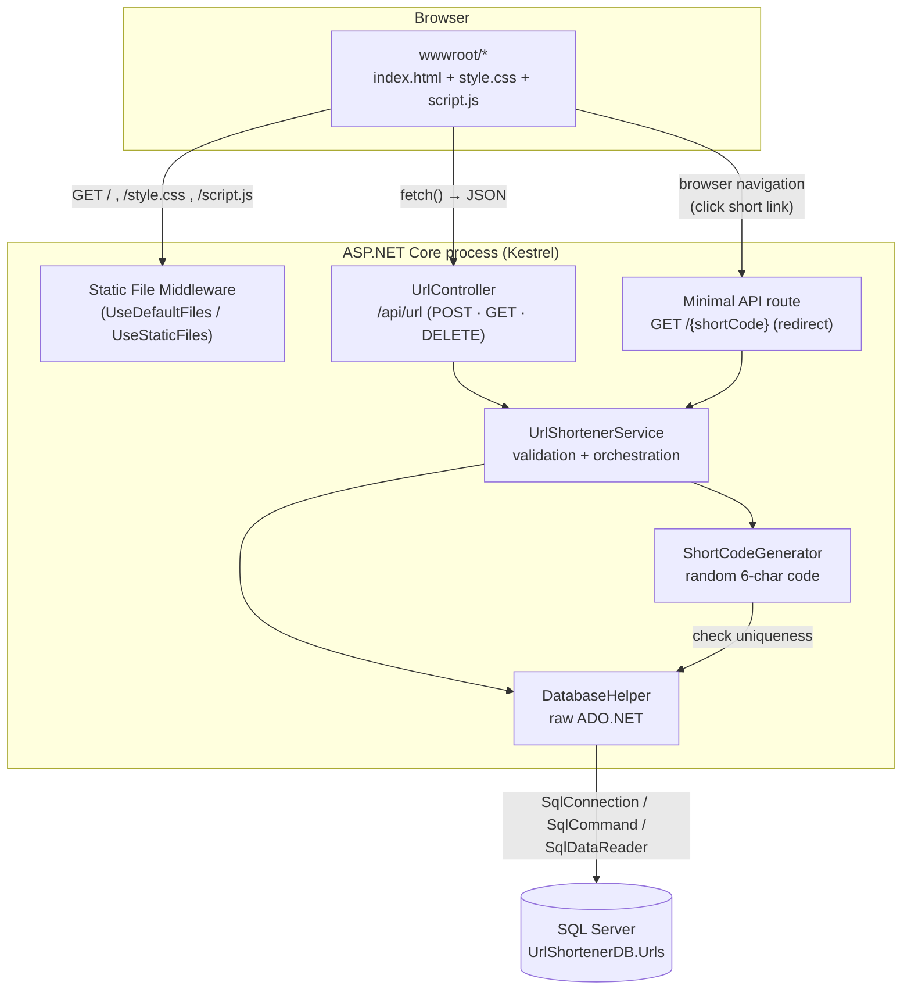

# URL Shortener

A full-stack URL shortener built with **ASP.NET Core Web API (.NET)**, **ADO.NET**, **SQL Server**, and a vanilla **HTML/CSS/JavaScript** frontend. No Entity Framework, no frontend frameworks — raw `SqlConnection`/`SqlCommand` on the backend, raw `fetch()` on the frontend.

College project. Runs entirely locally against a local SQL Server instance.

---

## Tech stack

| Layer    | Technology |
|----------|------------|
| Backend  | ASP.NET Core Web API (.NET 10), C# |
| Data access | ADO.NET (`SqlConnection`, `SqlCommand`, `SqlDataReader`) — no EF |
| Database | SQL Server (LocalDB / Express / full) |
| Frontend | HTML5, CSS3, vanilla JavaScript (Fetch API) — no React/Angular/Vue/jQuery |

---

## Project structure

```
UrlShortener/
├── Controllers/
│   └── UrlController.cs        # POST/GET/DELETE /api/url
├── Models/
│   └── UrlModel.cs              # DB row + request/response DTOs
├── Data/
│   └── DatabaseHelper.cs        # all raw ADO.NET SQL access
├── Services/
│   ├── ShortCodeGenerator.cs    # random 6-char code + uniqueness check
│   └── UrlShortenerService.cs   # validation + business logic
├── wwwroot/
│   ├── index.html
│   ├── style.css
│   └── script.js
├── Database/
│   └── schema.sql               # run once in SSMS to create DB + table
├── appsettings.json             # connection string
├── Program.cs                   # DI wiring, static files, redirect route
└── UrlShortener.csproj
```

Layering: **Controllers** handle HTTP → **Services** validate and orchestrate → **Data** talks to SQL Server. Controllers never touch `DatabaseHelper` directly.

---

## Explain it like I'm five

Imagine you have a friend whose full home address is really long to say out loud:
`"Apartment 4B, 221 Baker Street, next to the blue bakery, third floor."`

So you give that address a nickname: **"Sherlock's Place."** Now you write "Sherlock's Place" on a sticky note (that's the **short code**, like `Ab3X9Q`) and pin it to a giant corkboard (that's the **database**). The corkboard remembers: *this nickname → that long address*.

- **Shortening a URL** = writing a new sticky note and pinning it to the corkboard.
- **The short link** (`localhost:5000/Ab3X9Q`) = saying "Sherlock's Place" out loud instead of the whole address.
- **Clicking the short link** = someone hears "Sherlock's Place," walks to the corkboard, finds the sticky note, reads the real address, and walks straight there instead (that's the **redirect**). Every time someone does this, we add a tally mark to the note (**click count**).
- **The table on the webpage** = a photo of the whole corkboard, so you can see every nickname you've made.
- **Deleting a link** = ripping a sticky note off the board. Once it's gone, that nickname stops working.
- **"Please enter a valid URL"** = the corkboard refusing to pin a note that isn't a real address (like just "banana") — it has to look like a real place before it gets a nickname.

The C# code is just the person standing at the corkboard: writing new notes, reading them when someone asks, and tearing them down when told to. SQL Server *is* the corkboard — it's the only thing that actually remembers anything; if you stop the app and start it again, the notes are still pinned there.

---

## How it works

### Architecture

The whole app is a single ASP.NET Core process. It serves the static frontend, the JSON API, and the redirect endpoint all from one Kestrel server on one port — there is no separate frontend server or build step.



Each arrow into `DatabaseHelper` is a parameterized ADO.NET call — no ORM, no LINQ-to-SQL translation, just `SqlCommand` objects with `@Parameter` placeholders.

### Flow 1 — Shortening a URL

1. Browser: user types a URL, `script.js` validates it client-side (`new URL(...)`, checks scheme), then `fetch()`-POSTs `{ originalUrl }` to `/api/url`.
2. `UrlController.CreateShortUrl` re-validates server-side (never trust the client) and reads the caller's own scheme/host off the incoming request (`Request.Scheme`, `Request.Host`) — this becomes the base for the short link, so it is always correct for whatever host/port the app is actually reachable on, not a value frozen in a config file.
3. `UrlShortenerService.CreateShortUrl` calls `ShortCodeGenerator.GenerateUniqueShortCode()`, which repeatedly generates a random 6-character `[A-Za-z0-9]` string and asks `DatabaseHelper.ShortCodeExists` (a `SELECT COUNT(1) ... WHERE ShortCode = @ShortCode`) until it finds one that isn't taken (up to 10 attempts).
4. `DatabaseHelper.InsertUrl` runs `INSERT ... OUTPUT INSERTED.* VALUES (@OriginalUrl, @ShortCode)` — the `OUTPUT` clause hands back the full row (including the `Id` SQL Server just assigned and the `CreatedAt`/`ClickCount` defaults) in the same round trip, no second query needed.
5. The controller returns the created row plus the computed `shortUrl` as JSON; the frontend renders it in the result card and prepends a new row to the table — no page reload.

### Flow 2 — Opening a short link

1. Someone opens `http://<host>/<shortCode>` in a browser (a plain GET navigation, not `fetch`).
2. `Program.cs` registers this as a minimal API route, `MapGet("/{shortCode:length(6)}", ...)`, placed *after* static files and controllers so it only ever matches paths that aren't a real file or a registered API route.
3. It calls `UrlShortenerService.ResolveAndTrackClick`, which does a `SELECT` by `ShortCode` and, if found, an `UPDATE Urls SET ClickCount = ClickCount + 1 WHERE ShortCode = @ShortCode` (two separate ADO.NET calls, both parameterized).
4. If the code exists, the endpoint returns `Results.Redirect(originalUrl)` — an HTTP 302 with a `Location` header — and the browser follows it to the real destination. If not, it returns a 404 with a friendly JSON message instead of crashing.

### Flow 3 — Listing and deleting

`GET /api/url` runs a single `SELECT ... ORDER BY CreatedAt DESC` and streams rows back via `SqlDataReader`, newest first. `DELETE /api/url/{shortCode}` runs a parameterized `DELETE ... WHERE ShortCode = @ShortCode` and returns `204` if a row was actually removed, `404` otherwise — the frontend only removes the table row after the server confirms the delete succeeded.

### Why the layers are split this way

- **Controllers** only know about HTTP (status codes, request/response shapes). They never build SQL or generate codes themselves.
- **Services** hold every business rule — URL validation, "is this code unique", "build the redirect target" — so the rules are testable and reusable independent of HTTP.
- **Data** (`DatabaseHelper`) is the only class that imports `Microsoft.Data.SqlClient`. Every method opens its own `SqlConnection` in a `using` block, so connections are always closed/returned to the pool even if an exception is thrown mid-query.

---

## Prerequisites

1. **.NET SDK** — install from https://dotnet.microsoft.com/download. Check with:
   ```
   dotnet --version
   ```
2. **SQL Server** — any of these work:
   - SQL Server Express (recommended for this project, free): https://www.microsoft.com/sql-server/sql-server-downloads
   - SQL Server LocalDB (comes with Visual Studio)
   - A full SQL Server instance you already have
   - Via `winget`: `winget install --id Microsoft.SQLServer.2022.Express`
3. **SQL Server Management Studio (SSMS)** (optional, for running the schema script visually) — https://aka.ms/ssmsfullsetup. You can also run the script with `sqlcmd` (comes with SQL Server) instead of installing SSMS.

---

## Setup (step by step)

### 1. Confirm SQL Server is running

After installing SQL Server Express, check the service is up:

```powershell
Get-Service -Name 'MSSQL*'
```

You should see something like `MSSQL$SQLEXPRESS` with status `Running`. The instance name to use in your connection string is `.\SQLEXPRESS` (or just `.` / `localhost` if you installed a default, unnamed instance).

### 2. Create the database and table

Run `Database/schema.sql` against your instance. Either:

**Using SSMS:** open the file, connect to your server, hit Execute.

**Using sqlcmd:**
```powershell
sqlcmd -S ".\SQLEXPRESS" -E -i "Database\schema.sql"
```
(`-E` uses Windows integrated auth; drop it and add `-U`/`-P` if you use SQL auth instead.)

This creates the `UrlShortenerDB` database and the `Urls` table:

| Column      | Type           | Notes                     |
|-------------|----------------|---------------------------|
| Id          | INT IDENTITY   | Primary key                |
| OriginalUrl | NVARCHAR(MAX)  | NOT NULL                   |
| ShortCode   | VARCHAR(8)     | UNIQUE, NOT NULL           |
| CreatedAt   | DATETIME       | DEFAULT GETDATE()          |
| ClickCount  | INT            | DEFAULT 0                 |

### 3. Set the connection string

Edit `appsettings.json`:

```json
"ConnectionStrings": {
  "DefaultConnection": "Server=.\\SQLEXPRESS;Database=UrlShortenerDB;Trusted_Connection=True;TrustServerCertificate=True;"
}
```

- `Server=` — match your instance name from step 1 (`.\SQLEXPRESS`, `localhost`, `.\MSSQLSERVER`, etc).
- Using SQL auth instead of Windows auth? Replace `Trusted_Connection=True` with `User Id=...;Password=...;`.

Short links are built from whatever host/port the app is actually running on (see [How it works](#how-it-works)) — nothing to configure here. `Properties/launchSettings.json` pins the default dev port to `5000`.

### 4. Run the app

```powershell
dotnet restore
dotnet run
```

Open the printed URL (e.g. `http://localhost:5000`) in a browser. The frontend, API, and redirect endpoint are all served from the same app — no separate frontend server needed.

---

## Using the app

1. Paste a URL (must start with `http://` or `https://`) into the input box, click **Shorten URL**.
2. The generated short URL appears in a card below with a **Copy** button.
3. The **Recent Links** table lists every shortened URL (newest first) with click counts.
4. Click a short URL (in the table or the result card) to be redirected to the original URL — this also increments its click count.
5. Click **Delete** on a row to remove that link immediately (no page refresh).

---

## API reference

| Method | Route                    | Description                              |
|--------|--------------------------|-------------------------------------------|
| POST   | `/api/url`                | Create a shortened URL. Body: `{ "originalUrl": "https://..." }` |
| GET    | `/api/url`                 | List all URLs, newest first               |
| DELETE | `/api/url/{shortCode}`      | Delete a URL by its shortcode             |
| GET    | `/{shortCode}`              | Redirect to the original URL, track click |

Example:

```bash
curl -X POST http://localhost:5000/api/url \
  -H "Content-Type: application/json" \
  -d "{\"originalUrl\":\"https://github.com\"}"
```

```json
{
  "id": 1,
  "originalUrl": "https://github.com",
  "shortCode": "Ab3X9Q",
  "shortUrl": "http://localhost:5000/Ab3X9Q",
  "createdAt": "2026-07-04T21:39:13.467",
  "clickCount": 0
}
```

---

## Troubleshooting

**`System.NotSupportedException: Globalization Invariant Mode is not supported`** when calling any API endpoint
→ Make sure `<InvariantGlobalization>` is **not** set to `true` in `UrlShortener.csproj`. `Microsoft.Data.SqlClient` needs ICU globalization; invariant mode breaks every `SqlConnection.Open()` call.

**`Could not copy ... UrlShortener.exe ... being used by another process`** on `dotnet build`
→ A previous `dotnet run` is still holding the executable. Stop it first (find the process and kill it, or just close the terminal running it) then rebuild.

**Connection string errors / "A network-related or instance-specific error"**
→ Confirm the SQL Server service is running (`Get-Service -Name 'MSSQL*'`) and that `Server=` in `appsettings.json` matches the actual instance name.

**"Please enter a valid URL"**
→ The URL must be absolute and use `http://` or `https://`. Validation happens both in the browser (`script.js`) and on the server (`UrlShortenerService.IsValidUrl`) — invalid URLs are rejected before ever reaching the database.
